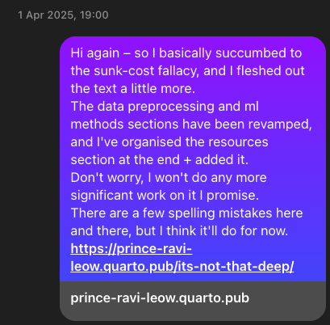

# It's Not That Deep

Source code to my little machine learning primer writing project, viewable at: https://prince-ravi-leow.quarto.pub/its-not-that-deep/

I am trying to update this primer as I learn more, and fix nagging typos here and there. 

# Document build instructions
- [Install `quarto`](https://quarto.org/docs/get-started/)
- Run: `quarto render` in repo directory
    - Open output file: `Its_Not_That_Deep.html`

# TO-DO
- [ ] More 'concrete' examples, or analogies to aid concept explanation